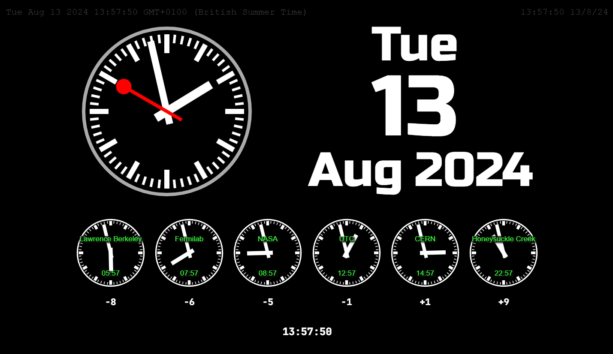

CoolClock - An analogue clock for your website
==============================================

This is my fork of CoolClock, a customisable JavaScript analogue clock.

.

New Features
------------

- **(30-May-2024)** - Added named timezone parameter to properly support time differences and cater for DST.
- **(30-May-2024)** - Completely removed _gmtOffset as results were problematic.
- **(12-May-2015)** - Shadows can now be applied to digital clock text.
- **(12-May-2015)** - New demo.html. Now renders clocks for all available skins.
- **(12-May-2015)** - A few bug fixes.
- **(18-Dec-2013)** - Clock parameters are now passed via canvas class attributes.
- **(18-Dec-2013)** - Seconds hand can now have a "smooth" motion".
- **(11-Dec-2013)** - Removed all cruft relating to Internet Explorer and ExplorerCanvas. 
  The clock works fine in IE 9.0 or later without them.
- **(11-Dec-2013)** - The clock can now synchronize itself with the web server's time. 
  (Note that this is experimental. Testers are much appreciated.)
- **(11-Dec-2013)** - Clocks can now have a title, for instance "Local Time",
  or "London, UK".
- **(11-Dec-2013)** - Proper skinning for titles and digital clocks.
- **(11-Dec-2013)** - Numerous cosmetic changes.

Requirements
------------

CoolClock requires canvas suport therefore it works best in Firefox, Safari or
Chrome. It also works with Internet Explorer versions 9 and later. CoolClock
does not use Flash.

Using CoolClock
---------------

Download `coolclock.js` and `moreskins.js` and put them in the
same folder as your html file.  In the head section of your html file add the
following:

````Html
<script type="text/javascript" src="coolclock.js"></script>
````

Or, if you want more skins:

````Html
<script type="text/javascript" src="coolclock.js"></script>
<script type="text/javascript" src="moreskins.js"></script>
````

Now there are two approaches to enabling your clocks, depending on whether your
page uses jQuery. If your page uses jQuery and jQuery is loaded before
coolclock.js is loaded, then you don't have to do anything more.

If your page doesn't use jQuery then you need to add
`onload="CoolClock.findAndCreateClocks()"` to your body tag, (or the equivalent
in your preferred javascript framework). For example, your body tag might look
like this:

````Html
<body onload="CoolClock.findAndCreateClocks()">
````

Somewhere in the body of your html file add the following:

````Html
<canvas id="clockid" class="CoolClock" _showDigital _clockTitle="Local Time"></canvas>
````

Extra attributes of the canvas tag will control the appearance of the clock.
The fields are as follows:

<table>
<tr><td>class</td><td>Required</td>

<td>Must be set to "CoolClock". Otherwise, your canvas will be left
alone.</td></tr>

<tr><td>`_skinId`</td><td>Optional. Default is "swissRail"</td>

<td>Specifies which skin to use for rendering the clock face. Four skins are
defined in coolclock.js: swissRail, chunkySwiss, chunkySwissOnBlack and
miliUbuntu. A lot more can be found in moreskins.js.</td></tr>

<tr><td>`_textSkinId`</td><td>Optional. Default is "std"</td>

<td>Specifies which skin to use for rendering the title and the digital clock.
Three such skins are defined for you: std, stdOnBlack and
miliUbuntu.</td></tr>

<tr><td>`_displayRadius`</td><td>Optional. Default is 85</td>

<td>Specifies the radius in pixels of the clock.</td></tr>

<tr><td>`_renderRadius`</td><td>Optional. Default is 100</td>

<td>Specifies canvas size in pixels.</td></tr>

<tr><td>`_secondHand`</td><td>Optional. Default is "tick"</td>

<td>Set this to "none" if you want a clock with no second hand. Set it to
"tick" to have a second hand that ticks every second. Or to "smooth" for one
that rotates continuously. It should be noted that "smooth" consumes a lot of
CPU time.</td></tr>

<tr><td>`_timezone`</td><td>Optional</td>

<td>Named timezone, used to provide time in another region and includes Daylight Saving Time.
If you don't specify anything you get local time (or server time, if your
clocks are sync'ed with the web server). If you specify a value (standard javascript naming such as Europe/London)
it will be used to show time in that timezone.  
This replaces the previous gmtOffset parameter which did not compensate for DST.</td></tr>

<tr><td>`_showDigital`</td><td>Optional</td>

<td>If you define this tag then a digital clock will be rendered on top of the
clock face.</td></tr>

<tr><td>`_clockTitle`</td><td>Optional</td>

<td>Add some text here and it will be rendered on top of the clock face, as a
title to the clock.</td></tr>

<tr><td>`logClock`</td><td>Optional</td>

<td>Set this to "normal" to get a logarithmic clock, or to "reverse" to get a
reverse logarithmic clock. (By default, of course, the clock is
linear.)</td></tr>

</table>

Skipping a field indicates that you want the default value.

If you want to add a real css class to your clock canvases you can do so by
adding a space then the class. For example:

````Html
<canvas id="clk1" class="CoolClock myClock"></canvas>
````

And of course you can add styles directly if you need to, eg:

````Html
<canvas id="clk2" style="display:block;" class="CoolClock"></canvas>
````

The id can be anything but it should be unique of course.

Creating Your Own Skins
-----------------------

You can design your own clocks by adding entries to CoolClock.config.skins and
CoolClock.config.textSkins. The skin objects' properties are self-explanatory,
so just copy an existing skin and hack away.

Synchronize with Server time
----------------------------

To have your clocks synchronized with the web server's time, set
CoolClock.config.useServerTime to true before calling
CoolClock.findAndCreateClocks(). This will cause all clocks in your page to use
the server's clock (and not the user's computer clock) as their reference time.

(Note that this will only change the reference time. You can still use _gmtOffset
to have your clocks display different times to that of the server. Also, you
need jQuery for this to work; this is because the code uses Ajax to retrieve
the server time, and we need a framework to provide an Ajax implementation that
is compatible with all browsers.)

Authors
-------

CoolClock was originally created by Simon Baird.

This version forked from Pantelis Panayiotou.

Forked primarily to add timezone support which follows Daylight Saving Time changes.

License
-------

CoolClock is published under a BSD OpenSourceLicense that gives you the freedom
to use it pretty much however you want, including for commercial purposes, as
long as you keep my copyright notice. (You can see the full license text at the
top of coolclock.js).
